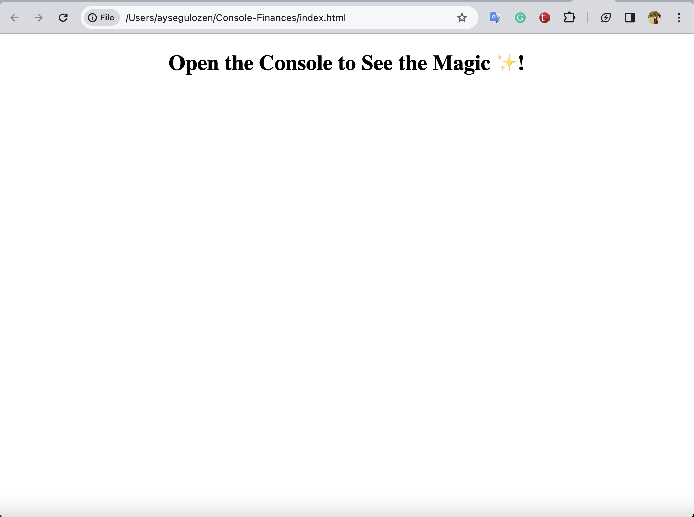
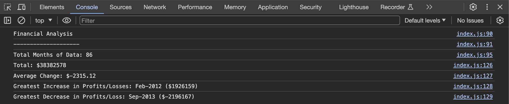

# Console-Finances

# Description
Welcome to console-finances! This project is part of my Frontend Bootcamp challenge, where I applied my knowledge of JavaScript syntax, primitive data types, conditional statements, logical comparison operators, arrays, and more to analyze financial records. The goal is to provide insights into a company's financial data.

# Deployed Page:
[console-finances](https://aysegulozen.github.io/Console-Finances/)

# GitHub Repo:
[github](https://github.com/Aysegulozen/Console-Finances)

# Installation
To explore this project, open it in your preferred browser, preferably Chrome. Use the browser's developer tools by pressing Option + ⌘ + J and navigate to the 'Console' tab.

# Usage
Visit the provided URLs to access the latest deployed version of console-finances. Utilize the browser console for a detailed financial analysis.

# Learnings / Future Work
This project allowed me to reinforce my understanding of JavaScript fundamentals. In the future, I plan to enhance the user interface and possibly implement additional features for a more comprehensive financial analysis experience.

# Credits
Throughout working on this challenge, I sought the knowledge and advice from multiple sources including:
- https://developer.mozilla.org/en-US/docs/Web/JavaScript/Data_structures
- https://www.w3schools.com/js/js_comparisons.asp
- https://www.w3schools.com/js/js_datatypes.asp

# License
This project does not have a specified license.

# Screenshots

